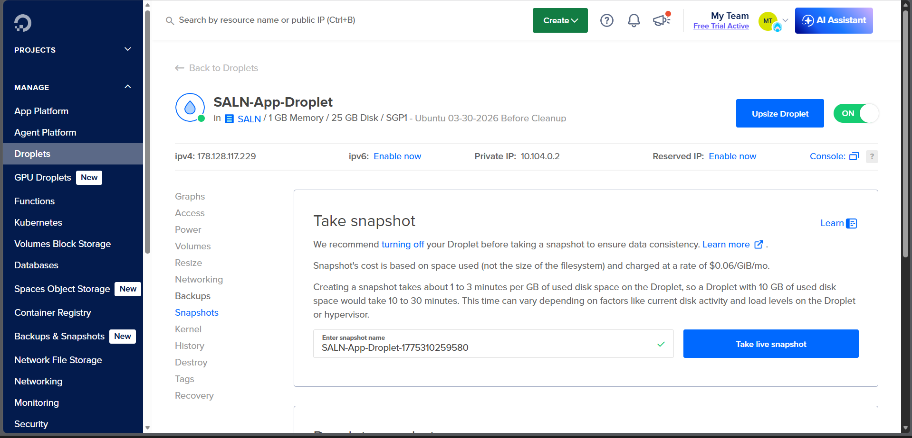
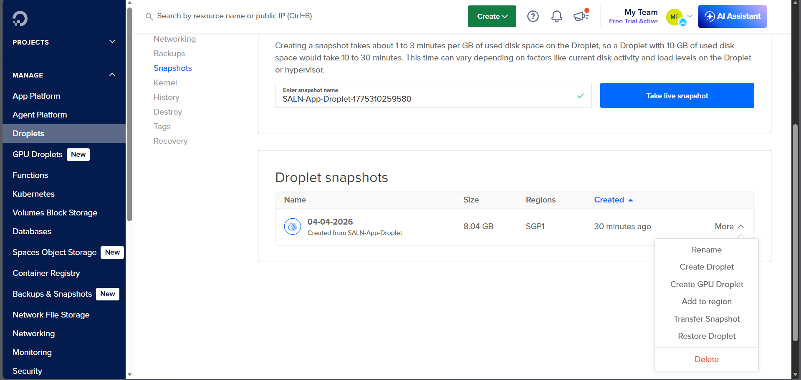

# Backup/Reinstall Procedures

## Digital Ocean Backups

The Digital Ocean droplet for this project has weekly backups enabled. As seen in the *Backup* tab of the droplet's dashboard, it is set to backup every **Sunday, 12am Manila Time** (Saturday, 4pm UTC).

## Digital Ocean Snapshots

Aside from having weekly backups, you could also create snapshots of the droplet. This could be done whenever you feel like it, for example, major updates to production code or major updates to droplet/VM configuration. 

To create a snapshot:

1. Turn off your droplet.
2. Click the **Take Live Snapshot** button.

You will then see the new snapshot created in the **Droplet Snapshots** table. Upon opening the **More** dropdown, you have some interesting options.

- You could create a new droplet using that snapshot via **Create Droplet**.
- You could revert the droplet to that snapshot via **Restore Droplet**.

