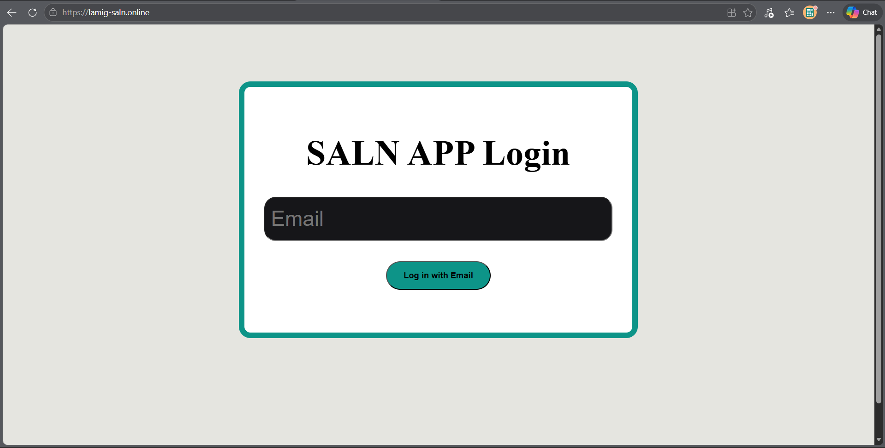
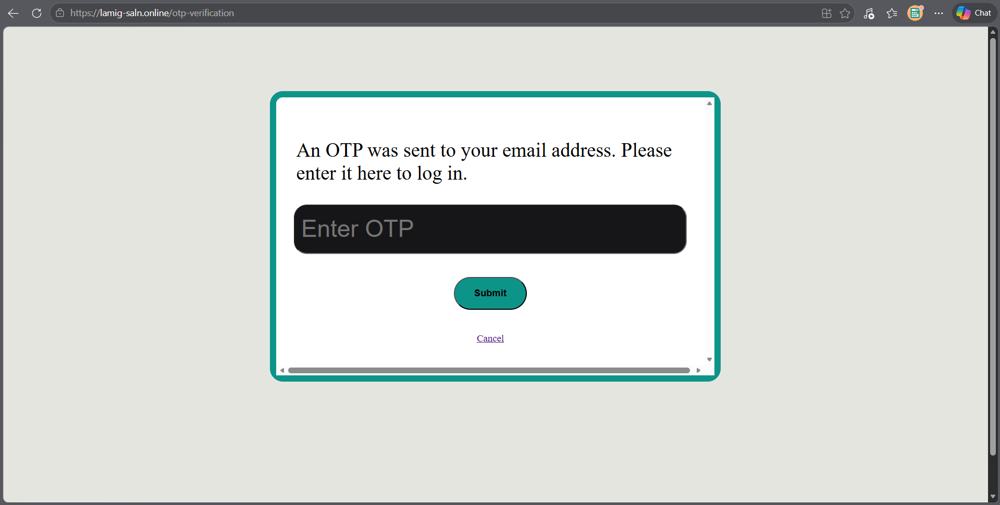
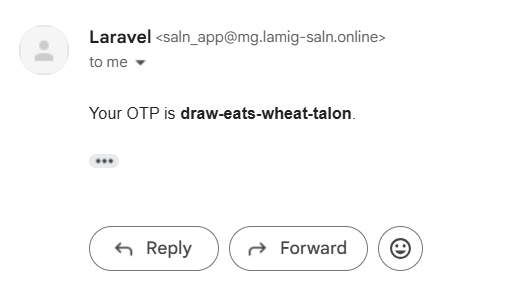
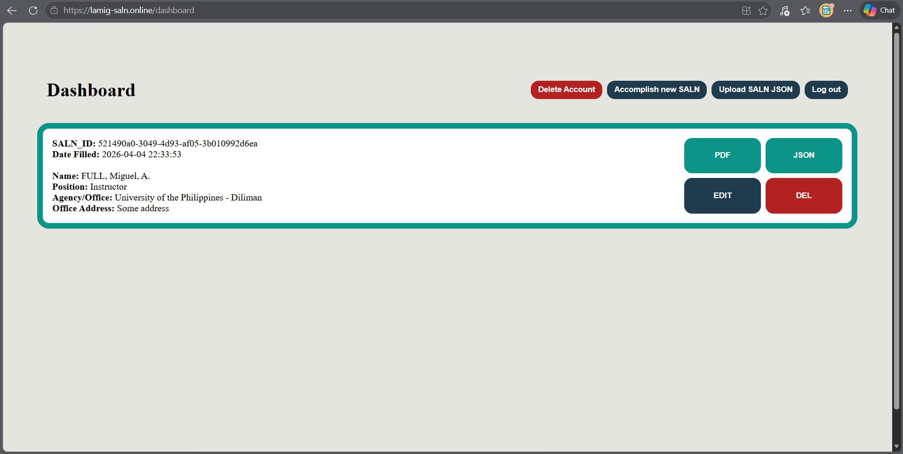
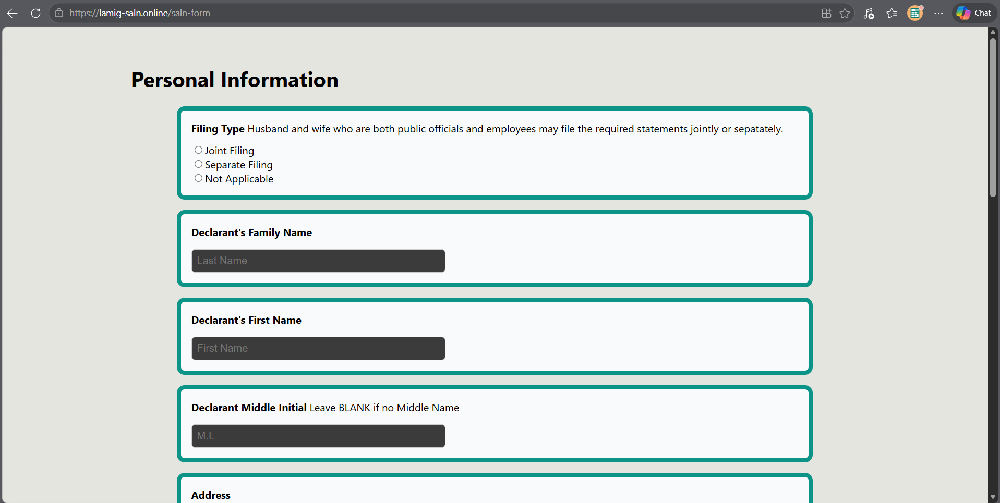
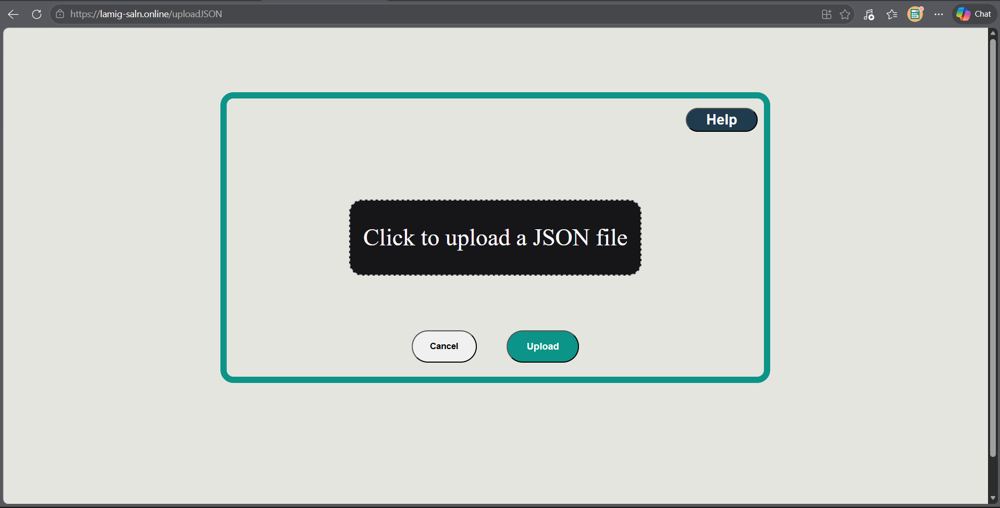
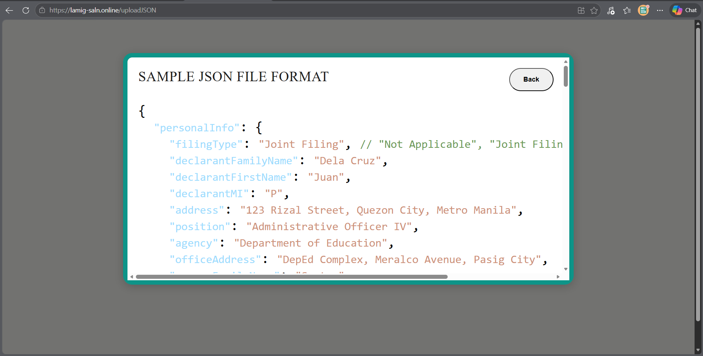
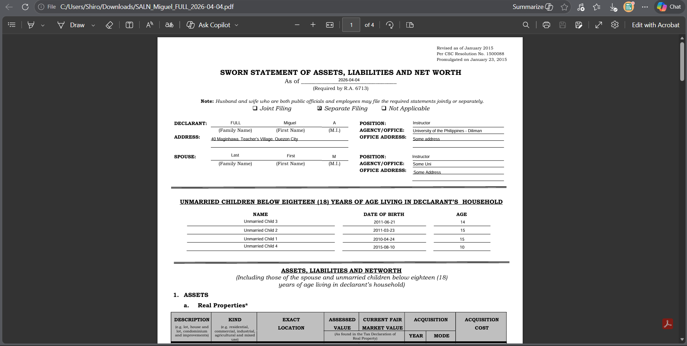
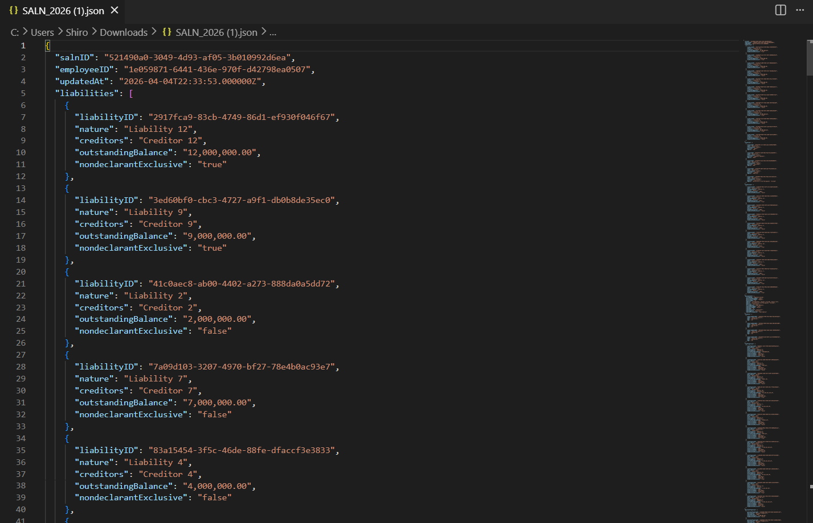
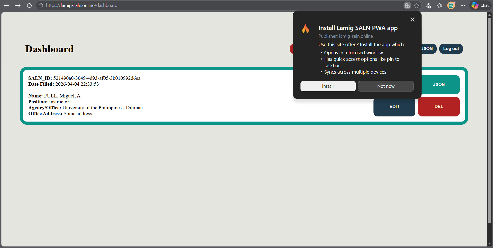

# User Manual

This is the user manual of the app. This includes all the use cases of the app. 

The app could be accessed via [https://lamig-saln.online](https://lamig-saln.online).

It could also be accessed offline after accessing the website and also be installed as a Progressive Web App.

## Login and OTP Verification

In the event you have not yet logged into an account, you would start off on the login page, which asks you for an email to associate your account with.

After entering an email, you would be sent to a page asking for an OTP, which is composed of four concatenated words.

This OTP is seen in the inbox of the entered email. This is sent from `saln_app@mg.lamig-saln.online`

This sends you to the dashboard.

## Dashboard

This is the dashboard. If you are already logged in, then going to `https://lamig-saln.online` will immediately send you here.

It has actions for the account and actions per SALN Form, all of which will be covered in the following sections.

## Log Out

On the dashboard, pressing the **Log Out** button will log you out of your account and then send you back to the login page. This does not delete anything from the server's database.

## Delete Account

On the dashboard, pressing the **Delete Account** button will log you out of your account and then send you back to the login page. Your email and its SALN Forms will be deleted from the server's database.

## Accomplish New SALN

On the dashboard, pressing the **Accomplish New SALN** button will send you to a digitilized version of the physical SALN Form. The user could fill this form out and then save it. Upon saving it, the user will be sent back to the dashboard and the new entry will be seen in his list of SALN Forms.

## Upload SALN JSON

On the dashboard, pressing the **Upload JSON** button will send you to a method of entering SALN Form data via a JSON file. 

The format of the JSON file could be seen in the **Help** tab.

## Export SALN PDF

Clicking the **PDF** button for a SALN Form on the dashboard will export that SALN Form's data placed into a PDF version of the original SALN Form. 

## Export SALN JSON

Clicking the **JSON** button for a SALN Form on the dashboard will export that SALN Form's data as a JSON file.

## Edit SALN Form

Clicking the **EDIT** button for a SALN Form will send you to the digital version of the SALN Form with its entries already there. You could edit fields in the digital SALN Form and then save it.

## Delete SALN Form

Clicking the **DEL** button for a SALN Form will delete it from the server's database.  

## Offline Mode

With the use of a Service Worker, the developers have made it so that the website is cached as you use it. This means that you have some functionality even though you are offline. These functions include:

- Accomplishing a new SALN Form
- Uploading a SALN JSON
- Editing a SALN Form
- Exporting a SALN From as a PDF
- Exporting a SALN Form as a JSON
- Deleting a SALN Form
- Logging Out

You could do these functions offline. Then once you go back online, the Service Worker will resend the API calls you made to the server.

Do note that in the case of multiple offline updates to a single SALN Form (case of multiple devices), the update with the latest `updatedAt` timestamp will prevail. 

## Install PWA

Installing the app as a Progressive Web App could be done via the install button of your browser when accessing any page on `https://lamig-saln.online`. 

This install button is typically found on the search bar. For example below, Microsoft Edge is being used. 

